<h1 align="center">Facundo Nahuel Dubois</h1>

<a href="#yo"> 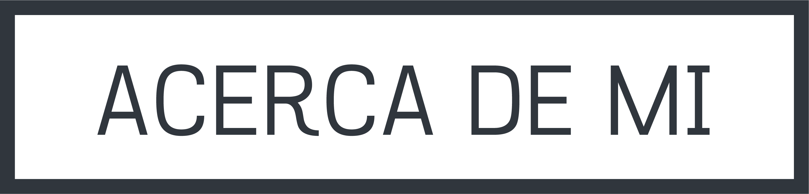</a>
<a href="#repositorios"> 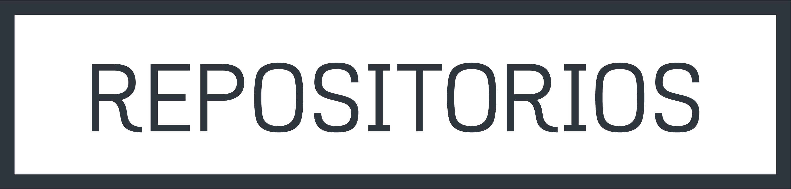</a>
<a href="#habilidades"> 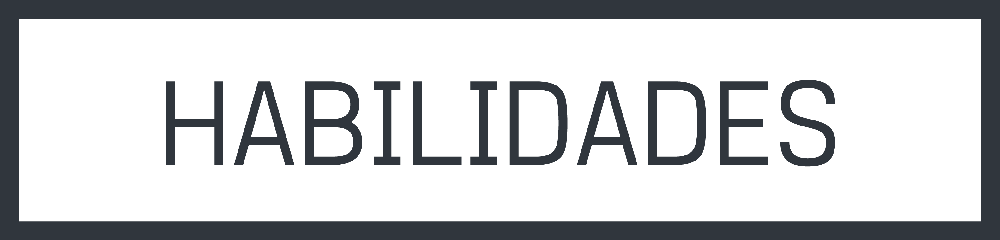</a>
<a href="#capacitaciones"> 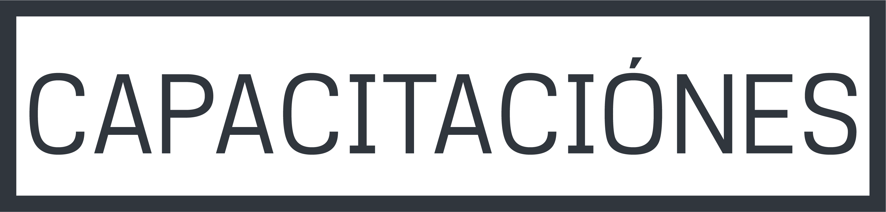</a>
<a href="#trabajos"> 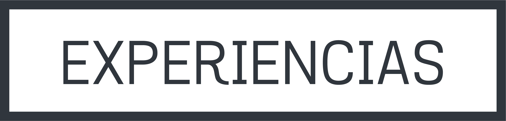</a>
<a href="#redes"> 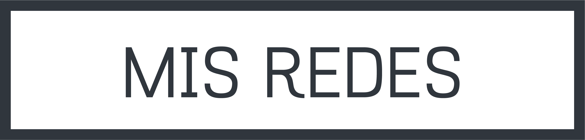</a>

 

-----------------------------------------------------------
<h2  font-size="75px" align="center">🦝 Acerca de mi: 🦝</h2>

-----------------------------------------------------------
Es complicado presentarme, así que para descontracturar voy a ir a lo convencional:  

___Estudios:___ oficialmente tengo el título de técnico superior en desarrollo de software desde inicios del 2021.  
___Edad:___ como la edad varía por año, dejo que el cálculo lo hagas vos... Nací el 20/06/2000.  
___Pasiones:___ me apasiona aprender mucho de algo, también todo lo relacionado al diseño, las películas y los mapaches.  
 
___Mis mayores Fortalezas:___  
- Hasta que no termino algo no paro, por lo tanto trato de buscarle siempre la vuelta a todo con tal de terminarlo.
- Me gusta mucho aprender.
- Me encanta el área del diseño, debido a esto, siempre busco una estética agradable en mis trabajos.
- Me adapto a las diferentes metodologías de trabajo.
- Tengo los principios del cooperativismo a flor de piel. 

___Mis mayores Debilidades:___  
- Soy una persona algo introvertida y trabajo para superarme.
- Al no parar si no termino algo, a veces se me hace complicado el gestionar mis tiempos.

 

-----------------------------------------------------------
<h2 id="repositorios" font-size="75px" align="center">📁 Repositorios: 📁</h2>

-----------------------------------------------------------
<a href="https://github.com/duboisfacu/asistencias">
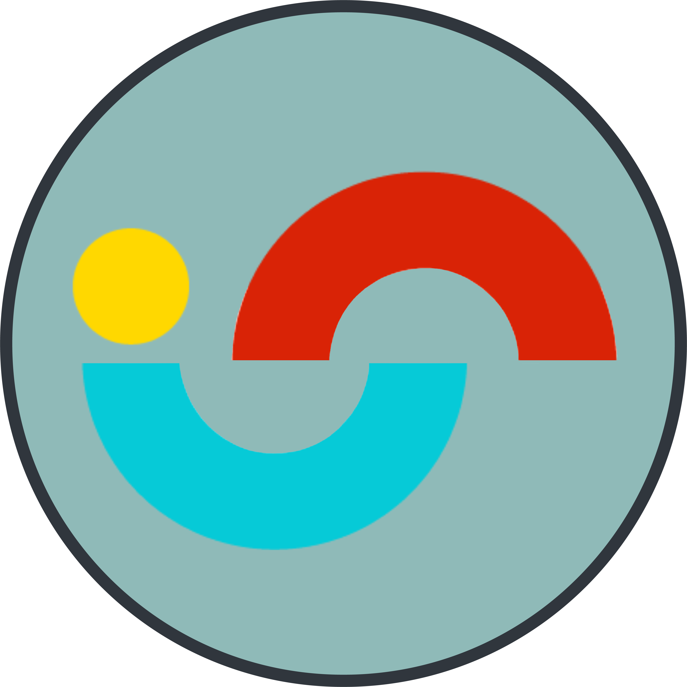
</a>
<pre>
Ruta: <a href="https://github.com/duboisfacu/asistencias">duboisfacu/asistencias</a>
Descripción: Asistencias es un sistema de asistecncias desarrollado 
como proyecto de tesis para la Tecnicatura Superior en 
Desarrollo de Software en el Instituto Superior Dr. Carlos María Carena.
<strong>Lenguaje: Visual Basic</strong>
</pre>
<a href="https://github.com/duboisfacu/polo-python">
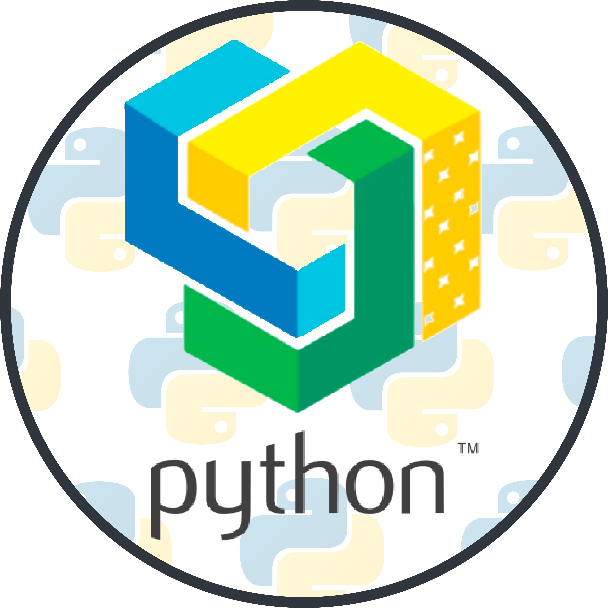
</a>
<pre>
Ruta: <a href="https://github.com/duboisfacu/polo-python">duboisfacu/polo-python</a>
Descripción: Polo-Python es un repositorio de ejercicios y actividades 
realizadas para el curso de Introducción a la Programación con Python 
provisto por el Polo Tecnológico de Mina Clavero.
<strong>Lenguaje: Python</strong>
</pre>

<a href="https://github.com/duboisfacu/makeitreal-js">
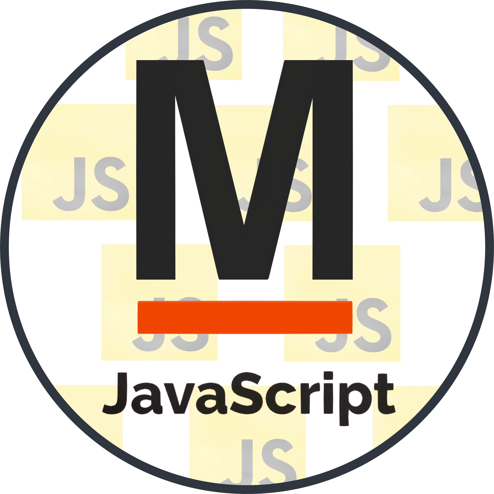
</a>
<pre>
Ruta: <a href="https://github.com/duboisfacu/makeitreal-js">duboisfacu/makeitreal-js</a>
Descripción: MakeItReal-JS es un repositorio de ejercicios realizadas 
para el curso de Introducción a JavaScript provisto por Make It Real.
<strong>Lenguaje: Javascript</strong>
</pre>

<pre>
Ruta: <a href="https://github.com/duboisfacu/chester-bot">duboisfacu/chester-bot</a>
Descripción: Chester-Bot es un bot multifuncional para la plataforma Discord. 
<strong>Lenguaje: JavaScript & Node.js</strong>
‎
</pre>

<pre>
Ruta: <a href="https://github.com/duboisfacu/cuadradito-y-circulito">duboisfacu/cuadradito-y-circulito</a>
Descripción: Cuadradito y Circulito es un juego desarrollado en GameMaker Studio 2.
<strong>Lenguaje: GML</strong>
‎
</pre>

</pre>

<pre>
Ruta: <a href="https://github.com/duboisfacu/avengers-game">duboisfacu/avengers-game</a>
Descripción: AvergersGame es un juego desarrollado en VB.NET en segundo 
año de la tecnicatura superior en desarrollo de software.
<strong>Lenguaje: VB.NET</strong>
</pre>

 

-----------------------------------------------------------
<h2 id="habilidades" font-size="75px" align="center">🧰 Habilidades: 🧰</h2>

-----------------------------------------------------------

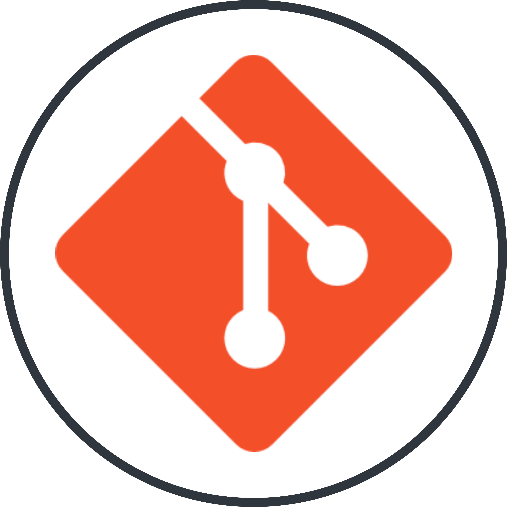

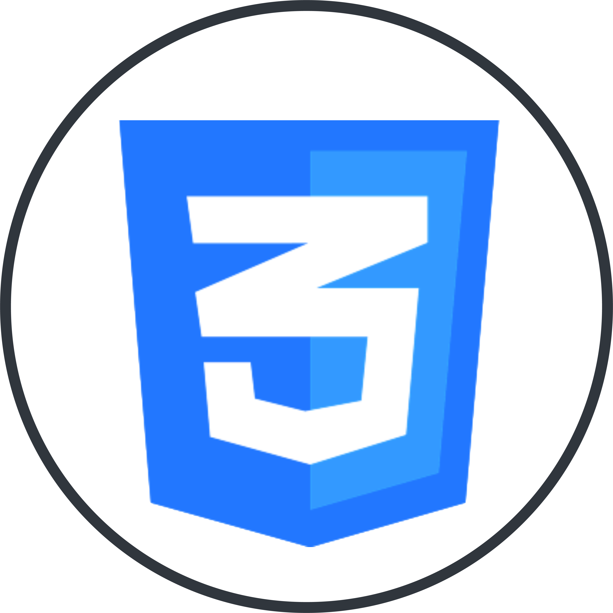

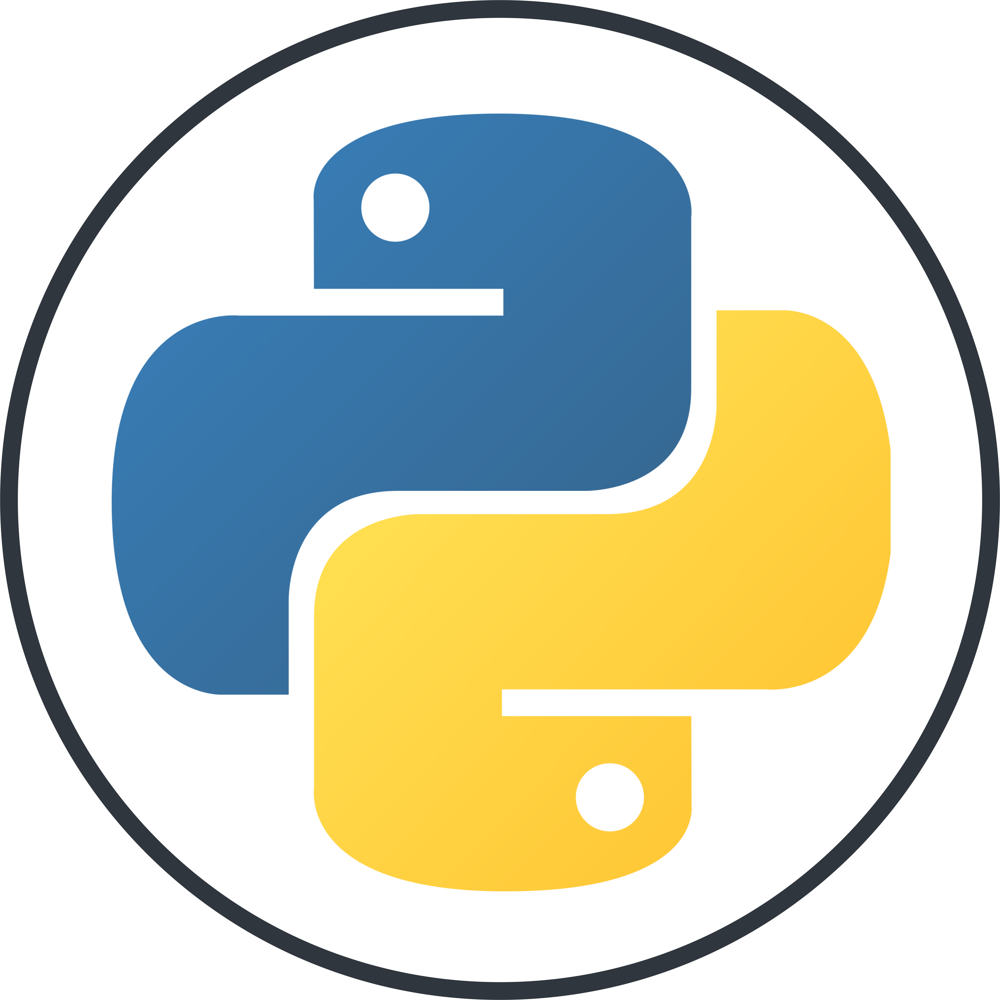

 

-----------------------------------------------------------

<h2 font-size="75px" align="center">📚 Capacitaciones: 📚</h2>

-----------------------------------------------------------

<a href="https://minaclavero.polotecnologico.ar/">
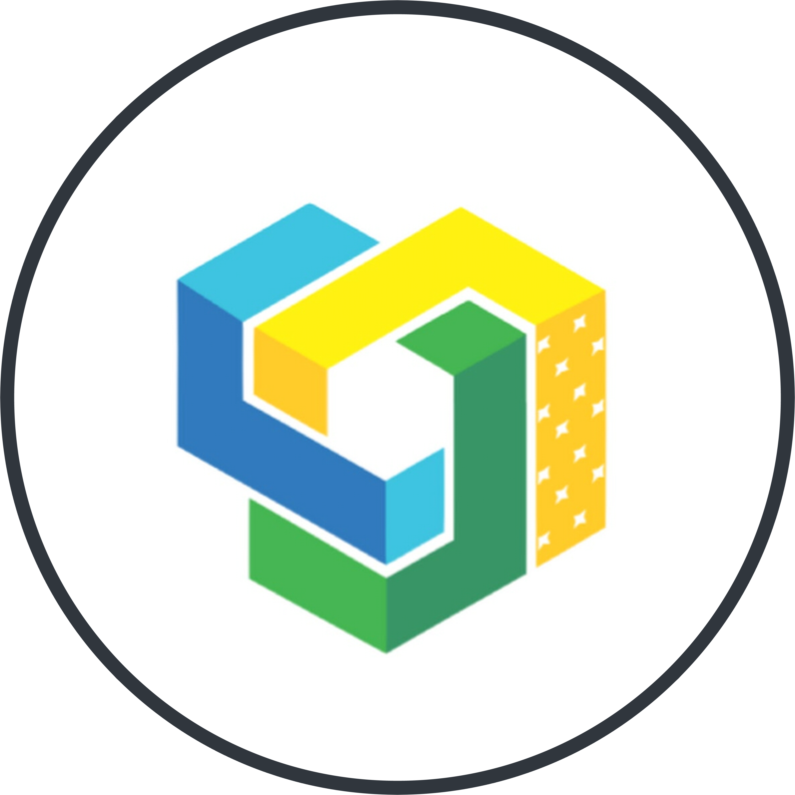
</a>

<pre>
🌟POLO TECNOLÓGICO MINA CLAVERO (en proceso 32/40 clases)
✨Introducción a la Programación (Python) 
ㅤ
</pre>

<pre>
🌟MASSVIAJEROS
✨Desarrollador Full Stack 
ㅤ
</pre>
 
<a href="https://courseit.io/">
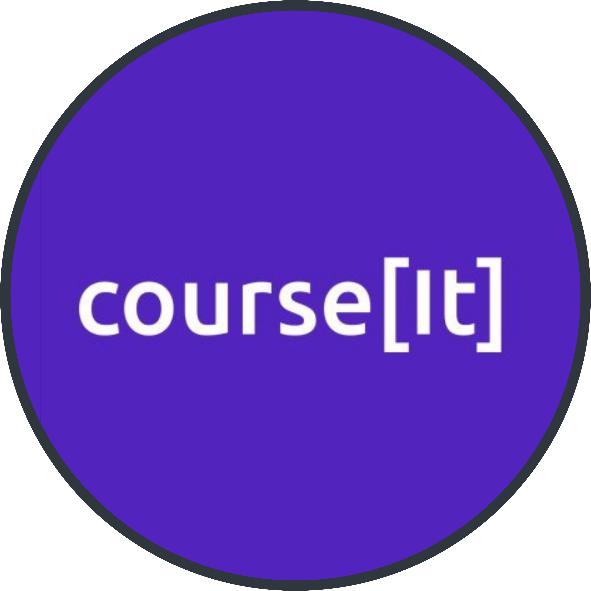
</a>
 
<pre>
🌟COURSEIT
✨Introducción al Desarrollo Web <a href="README.resources/certificados/Courseit - Introducción al Desarrollo Web.pdf">(certificado)</a>
✨HTML y CSS <a href="README.resources/certificados/Courseit - HTML y CSS.pdf">(certificado)</a>
</pre>
 

<pre>
🌟SCRUMstudy
✨Scrum Fundamentals Certified (SFC™) <a href="README.resources/certificados/SCRUMstudy - Scrum Fundamentals Cerified.pdf">(certificado)</a>

</pre>
 

 
<pre>
🌟COURSERA
✨Getting Started with Python <a href="README.resources/certificados/Coursera - Phyton From Everybody.pdf">(certificado)</a>
✨Using Python to Access Web Data <a href="README.resources/certificados/Coursera - Phyton From Everybody 3.pdf">(certificado)</a>
✨Python Data Structures <a href="README.resources/certificados/Coursera - Phyton From Everybody 2.pdf">(certificado)</a>
</pre>
 
<a href="https://ed.team/">
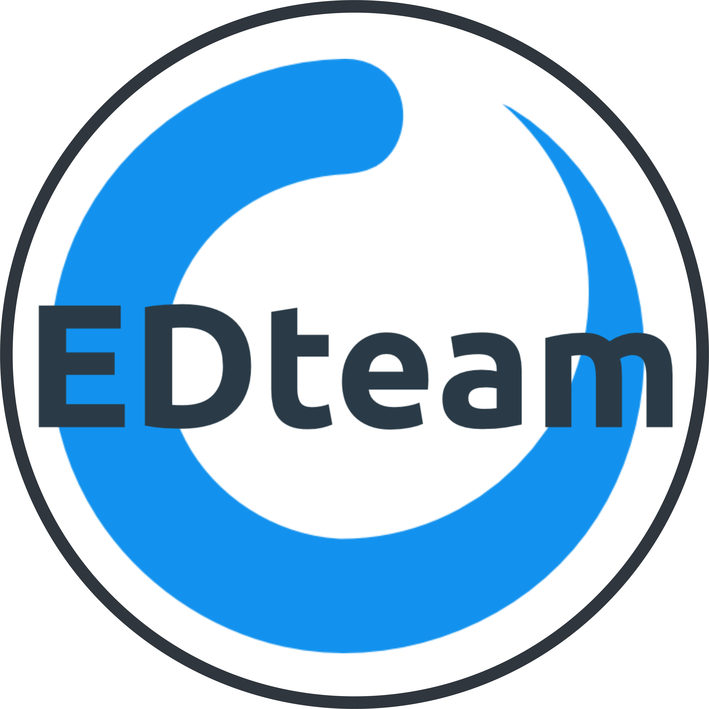
</a>
 
<pre>
🌟EDTEAM
✨GIT desde cero <a href="README.resources/certificados/Edteam - GIT desde cero .pdf">(certificado)</a>
✨Python desde cero <a href="README.resources/certificados/Edteam - Python desde cero.pdf">(certificado)</a>
</pre>

 

-----------------------------------------------------------
<h2 font-size="75px" align="center">👨‍💻 Experiencia Laboral 👨‍💻</h2>

-----------------------------------------------------------

<pre>
Empresa: Massviajeros
Fecha: abr 2021 – ago 2021
Campo: FrontEnd Developer (Trainee)

</pre>

-----------------------------------------------------------

<a id="mapache" href="https://user-images.githubusercontent.com/66006741/123548950-5bea7100-d73d-11eb-8275-2b3dfb192c94.png"> 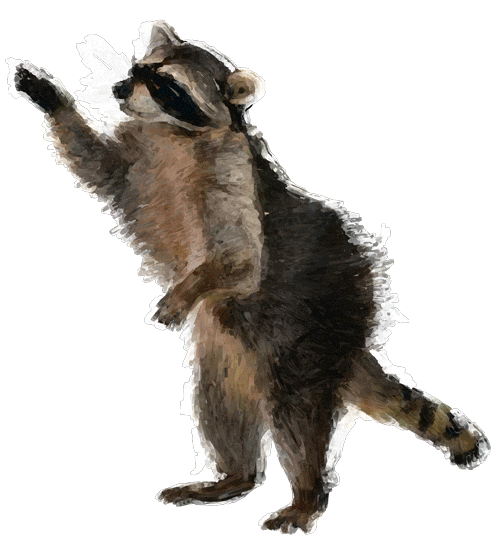</a>
 
¡Gracias por bajar hasta acá!

 
 
 

-----------------------------------------------------------

<h2 align="center">📱 Redes 📱</h2>
 
 

 -----------------------------------------------------------
 

  

 -----------------------------------------------------------
